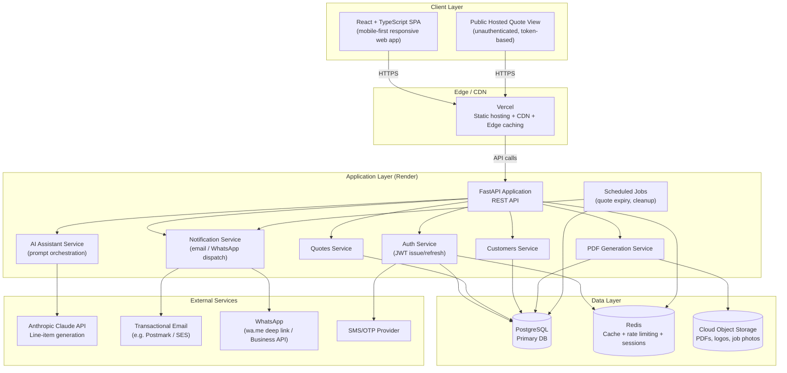
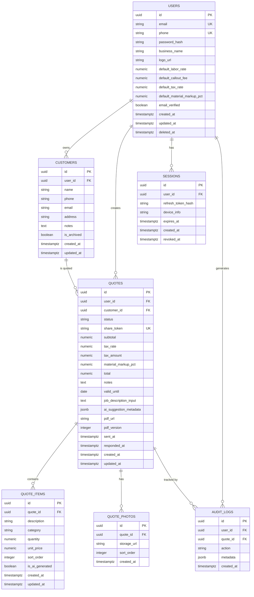

# ElectricQuote AI — Technical Architecture (V1)

**Document owner:** Lead Engineering
**Status:** Approved for build
**Version:** 1.0
**Companion document:** 01-PRD.md

---

## 1. High-Level Architecture



### Component Summary

| Layer | Responsibility |
|---|---|
| **Frontend (React + TypeScript)** | Mobile-first SPA; all authenticated user flows (dashboard, customers, quote creation/editing/history, settings). |
| **Public Hosted View** | Lightweight, unauthenticated, token-secured route serving the customer-facing quote page; served from the same frontend deployment but with a distinct, minimal render path for fast load on customer devices. |
| **Vercel** | Hosts the frontend build; provides CDN, edge caching, and preview deployments per pull request. |
| **FastAPI Backend (Render)** | Single deployable API service, internally modularized by domain (auth, customers, quotes, PDF, AI, notifications). Stateless, horizontally scalable. |
| **PostgreSQL** | System of record for all persistent business data. |
| **Redis** | Session/refresh-token support, rate limiting counters, short-lived caching (e.g., AI response caching, dashboard aggregates). |
| **Cloud Object Storage** | Stores generated PDFs, uploaded job photos, and business logos. Served via signed URLs, not public buckets. |
| **Anthropic Claude API** | Powers the AI line-item suggestion feature; called server-side only, never directly from the client. |
| **Transactional Email Provider** | Delivers quote emails and account emails (verification, password reset). |
| **WhatsApp** | V1 uses `wa.me` deep links for zero-integration-cost sharing; architecture allows a future swap to the WhatsApp Business Cloud API without client-side changes. |
| **SMS/OTP Provider** | Delivers phone-based OTP codes for phone-number login/registration. |

---

## 2. Technology Choices and Rationale

| Layer | Choice | Why |
|---|---|---|
| **Frontend** | React + TypeScript | Mature ecosystem, strong hiring pool, TypeScript enforces contract safety between frontend and backend (shared types reduce integration bugs), excellent mobile-responsive tooling. |
| **Backend** | FastAPI (Python) | Async-native (important for AI calls and I/O-bound PDF/storage work), automatic OpenAPI schema generation (keeps API design and docs in sync), strong typing via Pydantic reduces validation bugs, fast to iterate on for a small team. |
| **Database** | PostgreSQL | Relational integrity is essential for financial/quote data (line items, totals, audit trails); mature, battle-tested, strong JSON support for semi-structured fields (e.g., AI suggestion metadata) without needing a second database in V1. |
| **Auth** | JWT (access + refresh token pair) | Stateless access tokens scale horizontally without server-side session lookups on every request; refresh tokens stored server-side (Redis) allow revocation, balancing scalability with security control. |
| **Cache/Session store** | Redis | Sub-millisecond latency for rate limiting and refresh-token validation; also used for short-lived AI response caching to reduce redundant Claude API calls on retries. |
| **Storage** | Cloud object storage (S3-compatible) | PDFs and photos are unstructured binary assets; object storage is cheaper and more scalable than storing binaries in Postgres, and integrates cleanly with signed-URL access patterns. |
| **AI Integration** | Anthropic Claude API (server-side) | Used for natural-language-to-structured-line-items generation; called only from the backend to protect API keys and allow prompt/response auditing, caching, and rate control. |
| **Deployment (backend)** | Render, via Docker | Simple, cost-effective managed container hosting appropriate for a small team without dedicated DevOps; Docker ensures environment parity across local, staging, and production. |
| **Deployment (frontend)** | Vercel | Best-in-class static/SPA hosting with CDN, automatic preview deployments per PR, and zero-config integration with React build tooling. |
| **CI/CD** | GitHub Actions | Tight integration with the GitHub-hosted repository; runs lint/type-check/test/build on every PR and automates deployment triggers to Render and Vercel. |

---

## 3. Folder Structure

```
electricquote-ai/
├── frontend/
│   ├── src/
│   │   ├── api/                  # Typed API client (generated/aligned with backend OpenAPI schema)
│   │   ├── app/                  # App shell, routing, providers
│   │   ├── assets/
│   │   ├── components/
│   │   │   ├── common/           # Buttons, inputs, modals — design-system primitives
│   │   │   └── layout/           # Shell, nav, headers
│   │   ├── features/
│   │   │   ├── auth/
│   │   │   ├── dashboard/
│   │   │   ├── customers/
│   │   │   ├── quotes/
│   │   │   │   ├── components/
│   │   │   │   ├── hooks/
│   │   │   │   └── pages/
│   │   │   ├── settings/
│   │   │   └── public-quote-view/ # Unauthenticated hosted quote page
│   │   ├── hooks/                 # Shared hooks
│   │   ├── lib/                   # Utilities (formatting, validation, date/currency helpers)
│   │   ├── stores/                # Client state (React Query cache + minimal global state)
│   │   ├── types/                 # Shared TypeScript types (mirrors backend schemas)
│   │   └── main.tsx
│   ├── public/
│   ├── tests/
│   │   ├── unit/
│   │   └── e2e/
│   ├── package.json
│   └── vite.config.ts
│
├── backend/
│   ├── app/
│   │   ├── main.py                # FastAPI app entrypoint
│   │   ├── core/
│   │   │   ├── config.py          # Settings via environment (Pydantic Settings)
│   │   │   ├── security.py        # Password hashing, JWT encode/decode
│   │   │   ├── logging.py
│   │   │   └── exceptions.py      # Centralized exception types + handlers
│   │   ├── api/
│   │   │   └── v1/
│   │   │       ├── router.py      # Aggregates all v1 route modules
│   │   │       ├── auth.py
│   │   │       ├── users.py
│   │   │       ├── customers.py
│   │   │       ├── quotes.py
│   │   │       ├── quote_items.py
│   │   │       ├── ai.py
│   │   │       ├── files.py
│   │   │       └── public.py      # Unauthenticated hosted-quote endpoints
│   │   ├── domain/                # Core business entities & rules (framework-agnostic)
│   │   │   ├── users/
│   │   │   ├── customers/
│   │   │   ├── quotes/
│   │   │   └── ai_suggestions/
│   │   ├── services/              # Application/business logic layer
│   │   │   ├── auth_service.py
│   │   │   ├── quote_service.py
│   │   │   ├── customer_service.py
│   │   │   ├── pdf_service.py
│   │   │   ├── ai_service.py
│   │   │   └── notification_service.py
│   │   ├── repositories/          # Data access layer (Repository pattern over SQLAlchemy)
│   │   │   ├── base_repository.py
│   │   │   ├── user_repository.py
│   │   │   ├── customer_repository.py
│   │   │   └── quote_repository.py
│   │   ├── models/                # SQLAlchemy ORM models
│   │   ├── schemas/                # Pydantic request/response schemas
│   │   ├── db/
│   │   │   ├── session.py
│   │   │   └── migrations/         # Alembic migrations
│   │   ├── integrations/
│   │   │   ├── claude_client.py
│   │   │   ├── email_client.py
│   │   │   ├── whatsapp_client.py
│   │   │   ├── sms_client.py
│   │   │   └── storage_client.py
│   │   └── jobs/                   # Scheduled/background jobs (quote expiry, cleanup)
│   ├── tests/
│   │   ├── unit/
│   │   ├── integration/
│   │   └── conftest.py
│   ├── alembic.ini
│   ├── Dockerfile
│   ├── requirements.txt
│   └── pyproject.toml
│
├── infra/
│   ├── docker-compose.yml          # Local dev: backend + postgres + redis
│   └── render.yaml                 # Render service definitions
│
├── .github/
│   └── workflows/
│       ├── backend-ci.yml
│       ├── frontend-ci.yml
│       └── deploy.yml
│
└── docs/
    ├── 01-PRD.md
    ├── 02-Technical-Architecture.md
    └── api/                        # Generated OpenAPI reference
```

---

## 4. Database Schema

### 4.1 Entity-Relationship Overview



### 4.2 Table Definitions

**users**
| Column | Type | Constraints |
|---|---|---|
| id | UUID | PK, default gen_random_uuid() |
| email | VARCHAR(255) | UNIQUE, nullable (phone-only accounts allowed) |
| phone | VARCHAR(32) | UNIQUE, nullable (email-only accounts allowed) |
| password_hash | VARCHAR(255) | nullable (OTP-only accounts) |
| business_name | VARCHAR(255) | NOT NULL |
| logo_url | TEXT | nullable |
| default_labor_rate | NUMERIC(10,2) | NOT NULL, default 0 |
| default_callout_fee | NUMERIC(10,2) | NOT NULL, default 0 |
| default_tax_rate | NUMERIC(5,4) | NOT NULL, default 0 |
| default_material_markup_pct | NUMERIC(5,2) | NOT NULL, default 0 |
| email_verified | BOOLEAN | NOT NULL, default false |
| created_at | TIMESTAMPTZ | NOT NULL, default now() |
| updated_at | TIMESTAMPTZ | NOT NULL, default now() |
| deleted_at | TIMESTAMPTZ | nullable (soft delete) |

Constraint: `CHECK (email IS NOT NULL OR phone IS NOT NULL)`.

**customers**
| Column | Type | Constraints |
|---|---|---|
| id | UUID | PK |
| user_id | UUID | FK → users.id, NOT NULL, ON DELETE CASCADE |
| name | VARCHAR(255) | NOT NULL |
| phone | VARCHAR(32) | NOT NULL |
| email | VARCHAR(255) | nullable |
| address | TEXT | nullable |
| notes | TEXT | nullable |
| is_archived | BOOLEAN | NOT NULL, default false |
| created_at | TIMESTAMPTZ | NOT NULL, default now() |
| updated_at | TIMESTAMPTZ | NOT NULL, default now() |

**quotes**
| Column | Type | Constraints |
|---|---|---|
| id | UUID | PK |
| user_id | UUID | FK → users.id, NOT NULL, ON DELETE CASCADE |
| customer_id | UUID | FK → customers.id, NOT NULL, ON DELETE RESTRICT |
| status | VARCHAR(20) | NOT NULL, default 'draft', CHECK IN ('draft','sent','accepted','declined','expired') |
| share_token | VARCHAR(64) | UNIQUE, NOT NULL |
| subtotal | NUMERIC(12,2) | NOT NULL, default 0 |
| tax_rate | NUMERIC(5,4) | NOT NULL, default 0 |
| tax_amount | NUMERIC(12,2) | NOT NULL, default 0 |
| material_markup_pct | NUMERIC(5,2) | NOT NULL, default 0 |
| total | NUMERIC(12,2) | NOT NULL, default 0 |
| notes | TEXT | nullable |
| valid_until | DATE | nullable |
| job_description_input | TEXT | nullable |
| ai_suggestion_metadata | JSONB | nullable |
| pdf_url | TEXT | nullable |
| pdf_version | INTEGER | NOT NULL, default 0 |
| sent_at | TIMESTAMPTZ | nullable |
| responded_at | TIMESTAMPTZ | nullable |
| created_at | TIMESTAMPTZ | NOT NULL, default now() |
| updated_at | TIMESTAMPTZ | NOT NULL, default now() |

**quote_items**
| Column | Type | Constraints |
|---|---|---|
| id | UUID | PK |
| quote_id | UUID | FK → quotes.id, NOT NULL, ON DELETE CASCADE |
| description | VARCHAR(200) | NOT NULL |
| category | VARCHAR(20) | NOT NULL, CHECK IN ('labor','material','callout','other') |
| quantity | NUMERIC(10,2) | NOT NULL, CHECK (quantity > 0) |
| unit_price | NUMERIC(10,2) | NOT NULL, CHECK (unit_price >= 0) |
| sort_order | INTEGER | NOT NULL, default 0 |
| is_ai_generated | BOOLEAN | NOT NULL, default false |
| created_at | TIMESTAMPTZ | NOT NULL, default now() |
| updated_at | TIMESTAMPTZ | NOT NULL, default now() |

**quote_photos**
| Column | Type | Constraints |
|---|---|---|
| id | UUID | PK |
| quote_id | UUID | FK → quotes.id, NOT NULL, ON DELETE CASCADE |
| storage_url | TEXT | NOT NULL |
| sort_order | INTEGER | NOT NULL, default 0 |
| created_at | TIMESTAMPTZ | NOT NULL, default now() |

Constraint: max 5 photos per quote, enforced at the application layer.

**sessions**
| Column | Type | Constraints |
|---|---|---|
| id | UUID | PK |
| user_id | UUID | FK → users.id, NOT NULL, ON DELETE CASCADE |
| refresh_token_hash | VARCHAR(255) | NOT NULL |
| device_info | VARCHAR(255) | nullable |
| expires_at | TIMESTAMPTZ | NOT NULL |
| created_at | TIMESTAMPTZ | NOT NULL, default now() |
| revoked_at | TIMESTAMPTZ | nullable |

**audit_logs**
| Column | Type | Constraints |
|---|---|---|
| id | UUID | PK |
| user_id | UUID | FK → users.id, nullable (system actions) |
| quote_id | UUID | FK → quotes.id, nullable |
| action | VARCHAR(50) | NOT NULL (e.g., 'quote.created', 'quote.sent', 'quote.status_changed') |
| metadata | JSONB | nullable |
| created_at | TIMESTAMPTZ | NOT NULL, default now() |

### 4.3 Indexes

- `users(email)` — unique index, for login lookup.
- `users(phone)` — unique index, for OTP login lookup.
- `customers(user_id, is_archived)` — composite, for customer list queries.
- `customers(user_id, name)` — composite, supports name search (paired with `pg_trgm` for partial/fuzzy match).
- `customers(user_id, phone)` — composite, for duplicate-phone detection.
- `quotes(user_id, status)` — composite, for dashboard/status-filtered quote lists.
- `quotes(user_id, created_at DESC)` — composite, for default reverse-chronological quote history.
- `quotes(customer_id)` — for customer-detail quote history.
- `quotes(share_token)` — unique index, for public hosted-view lookup.
- `quote_items(quote_id, sort_order)` — composite, for ordered line-item retrieval.
- `quote_photos(quote_id, sort_order)` — composite.
- `sessions(refresh_token_hash)` — for refresh-token validation.
- `sessions(user_id, expires_at)` — composite, for session cleanup jobs.
- `audit_logs(quote_id, created_at)` — composite, for quote history/audit trail views.

### 4.4 Relationships Summary

- A **user** owns many **customers** and many **quotes** (1:N).
- A **customer** may be referenced by many **quotes** (1:N); deleting a customer is disallowed (`ON DELETE RESTRICT`) while quotes reference it — archiving is used instead to preserve quote integrity.
- A **quote** belongs to exactly one **user** and one **customer**, and has many **quote_items** and **quote_photos** (1:N, cascade delete with the quote).
- A **user** has many **sessions** (one per active device/refresh token).
- **audit_logs** reference a user and optionally a quote, providing a lightweight event trail without full row-versioning in V1.

---

## 5. API Design

All endpoints are prefixed `/api/v1`. Authenticated endpoints require `Authorization: Bearer <access_token>` unless marked Public.

### 5.1 Auth

**POST /auth/register**
- Purpose: Create a new user account (email or phone flow).
- Auth: Public
- Request: `{ email?, phone?, password?, business_name }`
- Response: `201 { user_id, access_token, refresh_token }`
- Errors: `409` account already exists · `422` validation failure (weak password, invalid email/phone format)

**POST /auth/login**
- Purpose: Authenticate via email/password.
- Auth: Public
- Request: `{ email, password }`
- Response: `200 { access_token, refresh_token, user }`
- Errors: `401` invalid credentials · `423` account locked (too many attempts)

**POST /auth/otp/request**
- Purpose: Request an OTP code for phone-based login/registration.
- Auth: Public
- Request: `{ phone }`
- Response: `200 { message: "OTP sent" }`
- Errors: `429` too many OTP requests · `422` invalid phone format

**POST /auth/otp/verify**
- Purpose: Verify OTP and issue tokens.
- Auth: Public
- Request: `{ phone, code }`
- Response: `200 { access_token, refresh_token, user }`
- Errors: `401` invalid/expired code · `429` too many attempts

**POST /auth/refresh**
- Purpose: Exchange a valid refresh token for a new access token.
- Auth: Public (requires valid refresh token in body/cookie)
- Request: `{ refresh_token }`
- Response: `200 { access_token, refresh_token }`
- Errors: `401` invalid/expired/revoked refresh token

**POST /auth/logout**
- Purpose: Revoke the current session's refresh token.
- Auth: Required
- Response: `204`
- Errors: `401` unauthenticated

**POST /auth/password/forgot**
- Purpose: Trigger password reset email.
- Auth: Public
- Request: `{ email }`
- Response: `200 { message: "If the account exists, a reset link was sent" }` (no account enumeration)
- Errors: `429` rate limited

**POST /auth/password/reset**
- Purpose: Set a new password using a reset token.
- Auth: Public (token-based)
- Request: `{ token, new_password }`
- Response: `200 { message: "Password updated" }`
- Errors: `400` invalid/expired token · `422` weak password

### 5.2 Users / Settings

**GET /users/me**
- Purpose: Fetch the authenticated user's profile and business settings.
- Auth: Required
- Response: `200 { id, email, phone, business_name, logo_url, default_labor_rate, default_callout_fee, default_tax_rate, default_material_markup_pct }`
- Errors: `401` unauthenticated

**PATCH /users/me**
- Purpose: Update business profile / default rates.
- Auth: Required
- Request: `{ business_name?, default_labor_rate?, default_callout_fee?, default_tax_rate?, default_material_markup_pct? }`
- Response: `200 { ...updated user }`
- Errors: `422` validation (e.g., negative rate)

**POST /users/me/logo**
- Purpose: Upload/replace business logo.
- Auth: Required
- Request: multipart/form-data, image file (max 5MB, png/jpg)
- Response: `200 { logo_url }`
- Errors: `413` file too large · `415` unsupported file type

### 5.3 Customers

**GET /customers**
- Purpose: List/search the user's customers.
- Auth: Required
- Query: `?search=&is_archived=&cursor=&limit=`
- Response: `200 { items: [...], next_cursor }`

**POST /customers**
- Purpose: Create a customer.
- Auth: Required
- Request: `{ name, phone, email?, address?, notes? }`
- Response: `201 { customer }`
- Errors: `422` validation · `200` with `duplicate_warning: true` flag if phone matches an existing record (non-blocking)

**GET /customers/{customer_id}**
- Purpose: Fetch a single customer with quote history summary.
- Auth: Required (must own the customer record)
- Response: `200 { customer, quotes: [...] }`
- Errors: `404` not found or not owned

**PATCH /customers/{customer_id}**
- Purpose: Update customer details.
- Auth: Required
- Request: `{ name?, phone?, email?, address?, notes? }`
- Response: `200 { customer }`
- Errors: `404` · `422`

**POST /customers/{customer_id}/archive**
- Purpose: Soft-delete (archive) a customer.
- Auth: Required
- Response: `200 { customer }`
- Errors: `404`

### 5.4 Quotes

**GET /quotes**
- Purpose: List/filter/sort the user's quotes.
- Auth: Required
- Query: `?status=&customer_id=&date_from=&date_to=&sort=&cursor=&limit=`
- Response: `200 { items: [...], next_cursor }`

**POST /quotes**
- Purpose: Create a new draft quote.
- Auth: Required
- Request: `{ customer_id, job_description_input? }`
- Response: `201 { quote }` (empty line items; status='draft')
- Errors: `404` customer not found · `422`

**GET /quotes/{quote_id}**
- Purpose: Fetch full quote detail including items and photos.
- Auth: Required (owner only)
- Response: `200 { quote, items: [...], photos: [...] }`
- Errors: `404`

**PATCH /quotes/{quote_id}**
- Purpose: Update quote-level fields (notes, valid_until, markup, tax_rate, status).
- Auth: Required
- Request: `{ notes?, valid_until?, material_markup_pct?, tax_rate?, status? }`
- Response: `200 { quote }`
- Errors: `404` · `409` editing an accepted quote without confirmation flag · `422`

**DELETE /quotes/{quote_id}**
- Purpose: Delete a draft quote (hard delete only permitted while status='draft').
- Auth: Required
- Response: `204`
- Errors: `404` · `409` cannot delete non-draft quote

**POST /quotes/{quote_id}/duplicate**
- Purpose: Create a new draft quote pre-filled from an existing one.
- Auth: Required
- Response: `201 { quote }`
- Errors: `404`

**POST /quotes/{quote_id}/items**
- Purpose: Add a line item to a quote.
- Auth: Required
- Request: `{ description, category, quantity, unit_price }`
- Response: `201 { item }` (also returns updated quote totals)
- Errors: `422` validation · `409` quote not editable

**PATCH /quotes/{quote_id}/items/{item_id}**
- Purpose: Edit a line item.
- Auth: Required
- Request: `{ description?, category?, quantity?, unit_price?, sort_order? }`
- Response: `200 { item, quote_totals }`
- Errors: `404` · `422`

**DELETE /quotes/{quote_id}/items/{item_id}**
- Purpose: Remove a line item.
- Auth: Required
- Response: `200 { quote_totals }`
- Errors: `404`

**POST /quotes/{quote_id}/photos**
- Purpose: Upload a photo attachment.
- Auth: Required
- Request: multipart/form-data (max 5MB, max 5 photos/quote)
- Response: `201 { photo }`
- Errors: `409` photo limit reached · `413` · `415`

**DELETE /quotes/{quote_id}/photos/{photo_id}**
- Purpose: Remove a photo attachment.
- Auth: Required
- Response: `204`
- Errors: `404`

**POST /quotes/{quote_id}/pdf**
- Purpose: Generate/regenerate the quote PDF.
- Auth: Required
- Response: `200 { pdf_url, pdf_version }`
- Errors: `422` quote has zero items · `503` PDF generation service failure

**POST /quotes/{quote_id}/send**
- Purpose: Mark a quote as sent and trigger delivery (email and/or WhatsApp link generation).
- Auth: Required
- Request: `{ channel: "email" | "whatsapp" | "link_only" }`
- Response: `200 { quote, share_url, whatsapp_link? }`
- Errors: `422` missing recipient contact info for chosen channel · `409` quote not ready (no items)

**POST /quotes/{quote_id}/status**
- Purpose: Manually mark a quote as accepted/declined.
- Auth: Required
- Request: `{ status: "accepted" | "declined" }`
- Response: `200 { quote }`
- Errors: `404` · `422` invalid transition

### 5.5 AI Assistant

**POST /ai/suggest-items**
- Purpose: Given a plain-text job description, return suggested line items.
- Auth: Required
- Request: `{ job_description: string, quote_id? }`
- Response: `200 { suggestions: [{ description, category, quantity, unit_price, confidence }] }`
- Errors: `422` empty/too-long description · `503` AI service unavailable (client falls back to manual entry) · `429` rate limited

### 5.6 Public (Unauthenticated Hosted View)

**GET /public/quotes/{share_token}**
- Purpose: Fetch a quote for the customer-facing hosted view.
- Auth: Public (token-based)
- Response: `200 { business: {...}, customer_name, items: [...], subtotal, tax, total, valid_until, status, notes }`
- Errors: `404` invalid/revoked token · `410` expired (returns limited payload with `expired: true`, not a hard error)

**POST /public/quotes/{share_token}/respond**
- Purpose: Customer accepts or declines the quote from the hosted view.
- Auth: Public (token-based)
- Request: `{ response: "accepted" | "declined" }`
- Response: `200 { status }`
- Errors: `404` · `409` quote already responded to or expired

### 5.7 Common Error Response Shape

```json
{
  "error": {
    "code": "VALIDATION_ERROR",
    "message": "Human-readable description",
    "field_errors": [{ "field": "quantity", "issue": "must be greater than 0" }]
  }
}
```

Standard HTTP status usage: `400` malformed request, `401` unauthenticated, `403` forbidden (authenticated but not owner), `404` not found, `409` conflict/invalid state transition, `413` payload too large, `415` unsupported media type, `422` validation error, `429` rate limited, `500` unhandled server error, `503` upstream dependency failure.

---

## 6. Security

- **Authentication:** JWT access tokens (short-lived, 15 minutes) + refresh tokens (long-lived, 30 days, stored hashed in `sessions` table, rotated on each use, revocable server-side).
- **Password hashing:** bcrypt with a per-install pepper in addition to per-password salt; never log or transmit raw passwords beyond the initial TLS-protected request.
- **Rate limiting:** Redis-backed sliding-window limits per IP and per user/account — stricter limits on `/auth/*` and `/ai/suggest-items` endpoints; standard limits on general API traffic.
- **Input validation:** All request bodies validated via Pydantic schemas at the API boundary; rejected requests never reach the service/domain layer.
- **SQL injection protection:** All database access via SQLAlchemy ORM/parameterized queries; no raw string-interpolated SQL permitted anywhere in the codebase (enforced via code review checklist and linting).
- **Tenant isolation:** Every query for customer/quote data is scoped by `user_id` at the repository layer, never trusting a client-supplied ID alone; ownership is re-verified server-side on every request.
- **Secrets management:** All API keys, database credentials, and JWT signing secrets stored in the deployment platform's encrypted environment variable store (Render/Vercel secrets); never committed to source control; `.env.example` documents required variables without values.
- **CORS:** Backend restricts allowed origins to the known frontend domain(s) (production Vercel domain + preview-deployment wildcard pattern for staging); credentials-mode requests only accepted from allow-listed origins.
- **File upload safety:** Uploaded images validated for MIME type and size server-side (not trusted from client-reported type); stored in object storage under non-guessable keys; served via signed, time-limited URLs rather than public buckets.
- **Public endpoint hardening:** `/public/quotes/{share_token}` uses a cryptographically random, non-sequential token (not the internal UUID) to prevent enumeration; rate-limited independently of authenticated traffic.

---

## 7. Logging, Monitoring, Error Handling, Health Checks

- **Structured logging:** JSON-formatted logs with request ID, user ID (when authenticated), route, latency, and status code for every request; sensitive fields (passwords, tokens, full customer PII) explicitly excluded from log payloads.
- **Error handling:** Centralized FastAPI exception handlers translate domain exceptions into the standard error response shape; unhandled exceptions are caught, logged with stack trace server-side, and returned to the client as a generic `500` without leaking internals.
- **Monitoring:** Application performance monitoring (e.g., via a provider such as Sentry for error tracking and basic APM) capturing error rates, latency percentiles (p50/p95/p99) per endpoint, and background job success/failure.
- **Alerting:** Threshold-based alerts on elevated `5xx` rate, AI service failure rate, PDF generation failure rate, and database connection pool exhaustion.
- **Health checks:** `GET /health` (liveness — process is running) and `GET /health/ready` (readiness — database and Redis connectivity confirmed) exposed for the deployment platform's health-check probes.
- **Audit trail:** Key business events (`quote.created`, `quote.sent`, `quote.status_changed`, `customer.archived`) written to `audit_logs` for traceability independent of application logs.

---

## 8. Scalability Plan

| Stage | Users | Approach |
|---|---|---|
| **10 users** | Pilot | Single small Render web service instance, single PostgreSQL instance (shared/starter tier), no caching layer strictly required but Redis included from day one to avoid a later migration. |
| **100 users** | Early growth | Vertical scaling of the single API instance if needed; database connection pooling (PgBouncer or Render's managed pooling) introduced; Redis used actively for session/rate-limit data and AI response caching to reduce Claude API cost. |
| **1,000 users** | Growth | Horizontal scaling of the FastAPI service (2–4 stateless instances behind Render's load balancing); read-heavy dashboard/history queries optimized with the indexes defined in Section 4.3; PDF generation moved to an async background worker queue if synchronous generation begins to affect request latency. |
| **10,000 users** | Scale | Introduce a dedicated background job/worker service (e.g., a task queue such as Celery or an async worker pool) fully decoupled from the request/response cycle for PDF generation, email/WhatsApp dispatch, and AI calls — the API layer only enqueues work and returns immediately with a status the client can poll. Database read replicas introduced for reporting/dashboard queries. CDN caching expanded for the public hosted quote view, which is highly cacheable. |
| **100,000 users** | Maturity | Database vertical scaling plus read replica fan-out; consider partitioning/archiving strategy for `quotes` and `audit_logs` by date range to keep hot-table size manageable; introduce a dedicated caching layer for dashboard aggregate metrics rather than computing on read; revisit multi-region deployment if the customer base becomes geographically distributed, with the public hosted-view path prioritized for edge/CDN delivery given its unauthenticated, cacheable nature. |

**Design principles that support this growth path without a rewrite:**
- The API is stateless from day one (session state lives in Redis/DB, not in-process), so horizontal scaling is a deployment change, not a code change.
- The Repository pattern isolates data access, so introducing read replicas or query optimization later doesn't require touching service/domain logic.
- PDF generation and external notification dispatch are already architected as distinct services behind clear interfaces, making the eventual move to an async job queue a matter of changing *how* they're invoked, not *what* they do.
- The public hosted-quote-view endpoint is deliberately simple and cache-friendly, anticipating CDN-level caching as traffic grows.

---

## 9. Testing Strategy

- **Unit tests:** Cover domain logic and services in isolation (pricing calculations, tax/markup math, status transition rules, validation logic) using mocked repositories/integrations. Target high coverage on `services/` and `domain/`.
- **Integration tests:** Exercise API endpoints against a real (test) PostgreSQL instance and Redis instance, verifying request validation, database persistence, tenant-isolation enforcement, and correct error responses. External services (Claude API, email, WhatsApp, SMS) are mocked/stubbed at their client boundary.
- **End-to-end tests:** Cover critical user journeys end-to-end through the frontend against a running backend: registration → business setup → create customer → create quote via AI suggestion → edit line items → generate PDF → send via email/WhatsApp link → customer views hosted quote → accepts.
- **Load testing:** Simulated concurrent load against the quote-creation and AI-suggestion endpoints (the two most latency-sensitive, resource-intensive paths) to validate the performance targets in the PRD's Non-Functional Requirements before major releases; conducted against a staging environment sized similarly to production.
- **Contract/schema testing:** Frontend TypeScript types are validated against the backend's generated OpenAPI schema in CI to catch drift between frontend and backend contracts before merge.

---

## 10. Coding Standards

- **Type hints:** Mandatory on all backend function signatures (Python) and all frontend module boundaries (TypeScript, `strict` mode enabled); CI fails on missing/incorrect types.
- **PEP 8:** Enforced via automated linting/formatting (e.g., `ruff`/`black`) in CI; no manual style debate in code review.
- **Clean Architecture:** Strict separation between `api/` (transport), `services/` (application logic), `domain/` (core business rules and entities), and `repositories/` (data access) — dependencies point inward; `domain/` has no framework or database imports.
- **SOLID principles:** Single-responsibility services (one service per bounded concern: quotes, customers, AI, notifications); dependency inversion via constructor-injected repository/client interfaces rather than direct instantiation inside services, enabling test doubles.
- **Dependency Injection:** FastAPI's dependency injection system is used to provide repository and service instances to route handlers, keeping route handlers thin (validation + delegation only, no business logic inline).
- **Repository pattern:** All database access goes through a repository class per aggregate (`UserRepository`, `CustomerRepository`, `QuoteRepository`); services never construct raw ORM queries directly, which keeps the domain/service layer testable and the persistence mechanism swappable.
- **Code review requirements:** No direct commits to `main`; all changes via pull request with at least one review, passing CI (lint, type-check, unit tests, integration tests) as a merge gate.
